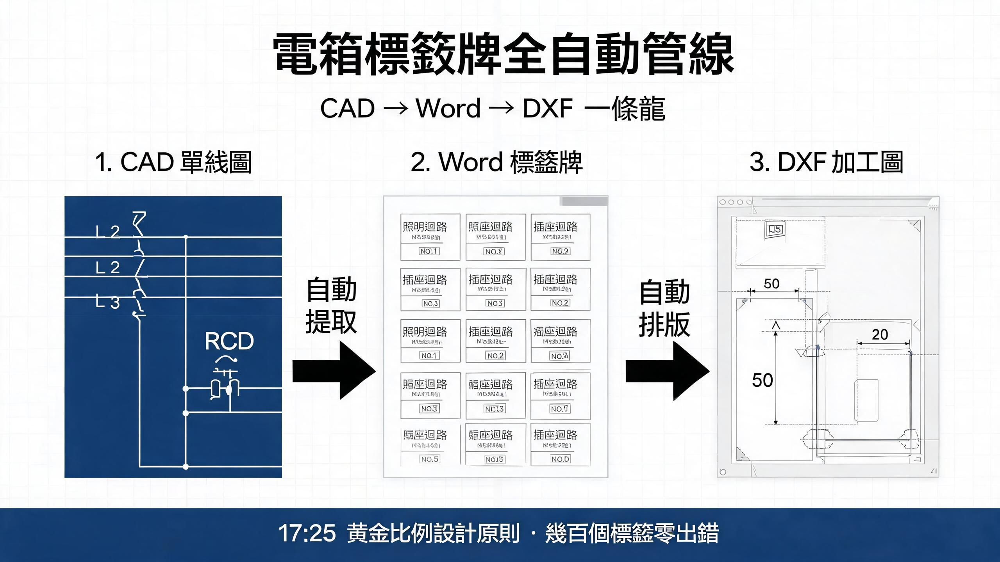

# electrical-panel-label-plates · 電箱標籤牌自動化

---
<div align="center">

**Full automation pipeline for electrical panel label plates**

CAD SLD → parsed circuit table → Word label plates → CAD vector fabrication drawing

[快速開始](#工作流) · [文件結構](#文件結構) · [技術棧](#技術棧)

</div>



---

> 從 CAD 單線圖（DWG/DXF）→ 解析迴路表（JSON）→ Word 標籤牌（docx）→ CAD 向量加工圖（DXF/SVG，1:1 尺寸註解）。全自動管線。

## 解決什麼問題

電氣工程中「電箱標籤牌」= 貼喺配電箱內每個斷路器下方嘅細標識條，黑底白字，寫「用途 + 迴路編號」。廣告商據此印製後貼到現場每個 MCB/RCD 上。

人手做嘅痛點：
- 幾十個迴路逐個打字，容易出錯
- RCD 極數判斷錯（最常見、最致命）
- 欄寬唔一致，印出來歪歪斜斜
- 要轉 CAD 加工圖俾廣告商，重新畫一次

**electrical-panel-label-plates** 將成個流程標準化、腳本化。

## 核心特性

### ⚡ 兩種 SLD 格式支援
- **Format A** — 縱向量表格式
- **Format B** — 橫向網格格式

### 🎯 17:25 斜線數原則
RCD 極數 = 單線圖符號嘅**斜線數目**，唔係睇額定值。
呢個係最容易犯、亦最致命嘅錯誤。

### 👤 Human-in-the-Loop 確認關卡
RCD 極數自動判斷後，必須人工確認先至生成。

### 📐 固定佈局欄寬鎖定
- `tblLayout=fixed` 鎖死欄寬
- 黑底 / 白字 / 黑體字體規格
- A3 / A4 自動紙張尺寸選擇

### 🛠️ CAD 向量輸出
- DXF + SVG 雙格式
- 1:1 尺寸註解
- 逐行 MTEXT 定位（避免 AutoCAD 渲染溢出）
- RCD 欄自動合併偵測

### 📏 雙行字幕系統
- `balance_lines` + `cell_lines`
- 2 行 cap 機制，確保唔會超出標籤高度

### ✅ 完整驗證套件
- `verify_label_widths.py` — 寬度驗證
- `verify_label_cad.py` — CAD 輸出驗證
- `render_check_label_cad.py` — 無頭自渲染檢查
- DXF → DWG 轉換（AutoCAD script）
- Pytest 回歸測試閘

### 🐛 21 個 documented pitfalls
Word 排版 / SLD 解析 / CAD 輸出三大類坑位全記錄。

## 工作流

```
CAD 單線圖 (DWG)
    ↓
DXF 轉換
    ↓
解析迴路表 (JSON)
    ↓
RCD 極數自動判斷（17:25 原則）
    ↓
👤 人工確認關卡
    ↓
生成 Word 標籤牌 (docx)
    ↓ （可選 --cad）
CAD 向量加工圖 (DXF / SVG，帶尺寸註解)
```

## 適用場景

| 場景 | 例子 |
|:---|:---|
| 從單線圖生成標籤牌 | 新裝修/改裝工程電箱標識 |
| 由 Word 轉 CAD 加工圖 | 俾廣告商/加工場 1:1 落料 |
| 批量調整標籤內容 | 更改迴路名稱、編號 |
| 現有標籤牌樣式核對 | 驗證欄寬、字體、格式 |

**唔適用**：電箱大樣圖/arrangement drawing；材料報批。

## 文件結構

```
electrical-panel-label-plates/
├── README.md       # 本文件
└── DOCUMENTATION.md        # 完整技能文檔（規格 + 工作流 + 坑位大全）
```

## 技術棧

- **Python** + **ezdxf** — DXF 解析與 CAD 輸出
- **python-docx** — Word 標籤牌生成
- **PyMuPDF** — PDF 渲染與驗證

## 兩條用戶鐵律

1. **只出 Word（.docx），不出 PNG 圖。** 除非用戶明確要求圖片（如俾廣告商嘅規格標註圖特例）。
2. **用戶手改過嘅 docx 只准讀取理解，禁止覆寫。** 重新生成時輸出必須去 temp 或加 `_v2` 後綴。

詳細用法請參閱 [DOCUMENTATION.md](DOCUMENTATION.md)。

---
## License

MIT License — feel free to use, modify, and share.
